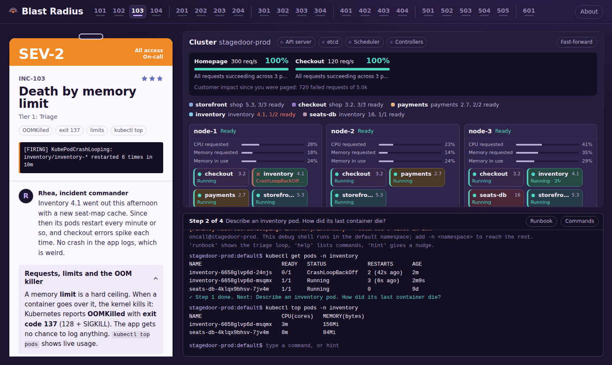

# Blast Radius

**A Kubernetes incident-response game that runs entirely in your browser.**

[](https://aboualyxcode.github.io/k8s-blast-radius/)
[](https://github.com/aboualyXcode/k8s-blast-radius/actions/workflows/test.yml)


You are the on-call SRE at Stagedoor, a fictional concert-ticketing company, and production is on fire. Work through 22 realistic incidents by typing real `kubectl` commands against a simulated cluster. A live cluster map and customer error-rate meters show whether your fixes are helping.

**[▶ Play Blast Radius](https://aboualyxcode.github.io/k8s-blast-radius/)**



Blast Radius is the advanced follow-up to [Desired State](https://github.com/aboualyXcode/k8s-desired-state). Desired State teaches the concepts; Blast Radius assumes you know them and asks you to debug.

## Contents

- [Quick start](#quick-start)
- [Features](#features)
- [Incident catalogue](#incident-catalogue)
- [How to play](#how-to-play)
- [Supported commands](#supported-commands)
- [Simulation fidelity](#simulation-fidelity)
- [Architecture](#architecture)
- [Writing a new incident](#writing-a-new-incident)
- [Testing](#testing)
- [Deploying your own copy](#deploying-your-own-copy)
- [Credits](#credits)

## Quick start

**Play online:** open [aboualyxcode.github.io/k8s-blast-radius](https://aboualyxcode.github.io/k8s-blast-radius/). Nothing to install.

**Run locally:** clone the repository and open `index.html`. It works straight from disk. If your browser restricts local files, serve the folder and visit http://localhost:8000:

```sh
git clone https://github.com/aboualyXcode/k8s-blast-radius.git
cd k8s-blast-radius
python3 -m http.server 8000
```

There is no backend, no real cluster and no build step. Progress is saved in your browser's local storage.

## Features

- **Failures follow real rules instead of scripts.** Every container image has a behavioural profile: startup time, memory curve, health endpoints, dependencies, API permissions and disk usage. The simulator applies Kubernetes' own rules, and the incident follows from them. A liveness probe that fires before a 45-second Java startup kills it. A large pod next to pods with no memory requests gets them OOM-killed. A missing DNS egress rule times out every lookup.
- **One network model for everything.** Your `curl`, `kubectl exec … -- curl`, readiness probes, service-to-service calls and the simulated customer traffic all go through the same path: DNS search domains, Services and named target ports, endpoints, NetworkPolicies and the Ingress.
- **Customer impact is measured.** Error-rate meters for the homepage and checkout update every tick. Each incident ends with a postmortem showing time to resolve, failed requests and a root-cause question.
- **Fixes must hold.** Many steps only complete once the system has stayed healthy for several consecutive checks, so a fix that flaps doesn't count.
- **Unsafe shortcuts are refused.** Deleting a default-deny policy, opening a NetworkPolicy to everyone, raising a quota owned by finance, binding `cluster-admin` or deleting a PodDisruptionBudget all get pushback.
- **Guidance fades as you progress.** Tier 1 shows the commands in each step. Tier 6 gives only a goal, with three layered faults where each fix uncovers the next.

## Incident catalogue

| Tier | Incident | Severity | Title | Topics |
|---|---|---|---|---|
| 1. Triage | INC-101 | SEV-2 | Checkout is crash looping | CrashLoopBackOff, `logs --previous`, ConfigMaps |
| | INC-102 | SEV-3 | The release that never landed | ImagePullBackOff, rollouts, rollback |
| | INC-103 | SEV-2 | Death by memory limit | OOMKilled, exit code 137, limits, `kubectl top` |
| | INC-104 | SEV-3 | Stuck in Pending | Pending, scheduler, requests |
| 2. Health checks and routing | INC-201 | SEV-2 | Half the homepage | readiness, liveness, rollouts |
| | INC-202 | SEV-3 | Killed before it could start | liveness, startupProbe, CrashLoopBackOff |
| | INC-203 | SEV-1 | Endpoints, but no answer | Services, targetPort, `exec` |
| | INC-204 | SEV-3 | Errors on every deploy | readiness, zero-downtime deploys |
| 3. Networking and DNS | INC-301 | SEV-1 | No such host | DNS, namespaces, search path |
| | INC-302 | SEV-1 | Default deny | NetworkPolicy, timeouts, least privilege |
| | INC-303 | SEV-1 | It's always DNS | CoreDNS, kube-system, ConfigMaps |
| | INC-304 | SEV-1 | Lockdown | NetworkPolicy, egress, DNS |
| 4. Access and platform | INC-401 | SEV-3 | Forbidden | RBAC, ServiceAccounts, `auth can-i` |
| | INC-402 | SEV-2 | Scale-up refused | ResourceQuota, admission, FailedCreate |
| | INC-403 | SEV-3 | 401 from the registry | imagePullSecrets, private registry |
| | INC-404 | SEV-3 | The PCI node pool | taints, tolerations, nodeSelector |
| 5. Capacity and storage | INC-501 | SEV-3 | Unbound | PersistentVolumeClaims, StorageClass, pvc-protection |
| | INC-502 | SEV-1 | No space left on device | volume expansion, init containers, cascading failures |
| | INC-503 | SEV-2 | Noisy neighbour | QoS classes, SystemOOM, evictions |
| | INC-504 | SEV-4 | The drain that wouldn't | drain, PodDisruptionBudget, maintenance |
| | INC-505 | SEV-1 | The autoscaler is blind | HPA, CPU requests, metrics |
| 6. Major incident | INC-601 | SEV-1 | On-sale night | multiple faults: Ingress, NetworkPolicy, OOMKilled |

## How to play

1. **Read the page.** The incident pass on the left shows the severity, the alert that fired, and a briefing from Rhea, the incident commander.
2. **Work the triage loop** in the terminal: confirm the symptom, find what is unhealthy, ask Kubernetes why (`describe`, events), ask the app why (`logs`), follow the request path, mitigate, fix, and verify. Type `runbook` at any time for a reminder.
3. **Watch the map.** Pods, nodes, Services, volumes and error-rate meters update live. Click a pod or Service to paste its name into the terminal; hover a Service to highlight its endpoints.
4. **Close the incident** and review the postmortem.

**Scoring:** every incident is worth three stars. Hints are free. Revealing a step's command costs a star.

**Keyboard:** <kbd>Tab</kbd> completes, <kbd>↑</kbd>/<kbd>↓</kbd> browse history, <kbd>Ctrl</kbd>+<kbd>C</kbd> stops a watch, <kbd>Ctrl</kbd>+<kbd>L</kbd> clears the screen, and <kbd>Ctrl</kbd>+<kbd>S</kbd> saves in the file editor.

## Supported commands

| Area | Commands |
|---|---|
| Inspect | `get` (`-o wide/yaml/json/jsonpath/custom-columns`, `-l`, `--field-selector`, `-A`, `-w`), `describe`, `logs` (`--previous`, `-c`, `--tail`), `top`, `events`, `explain`, `api-resources` |
| Debug inside pods | `exec <pod> -- curl / wget / nslookup / dig / nc / env / cat / ls / df` |
| Change | `apply`, `create`, `edit`, `patch` (strategic merge and JSON patch), `set image/env/resources`, `scale`, `rollout status/history/undo/restart/pause/resume`, `delete`, `label`, `annotate`, `expose`, `autoscale` |
| Nodes | `cordon`, `uncordon`, `drain` (respects PodDisruptionBudgets and retries), `taint` |
| Access | `auth can-i` (with `--as` and `--list`), `auth whoami`, `create role/rolebinding/serviceaccount` |
| Shell | pipes, `>` redirection, `grep`, `wc`, `head`, `tail`, `base64`, `curl`, `nslookup`, a YAML file editor, `runbook`, `hint`, `solution` |

**Simulated resource kinds:** Pods, Deployments (RollingUpdate and Recreate), ReplicaSets, DaemonSets, Services, Endpoints, Ingresses, NetworkPolicies, ConfigMaps, Secrets (including `docker-registry`), ServiceAccounts, Roles, RoleBindings, ClusterRoles, ClusterRoleBindings, ResourceQuotas, PersistentVolumeClaims, PersistentVolumes, StorageClasses, PodDisruptionBudgets, HorizontalPodAutoscalers, Nodes, Namespaces and Events.

Output formats and error messages closely follow real kubectl.

## Simulation fidelity

The simulator follows Kubernetes wherever it matters for debugging:

| Area | Behaviour |
|---|---|
| Scheduling | Filters on allocatable minus requested resources, taints and tolerations, nodeSelector and unbound claims, and reports the real `FailedScheduling` reasons. |
| Containers | Startup, liveness and readiness probes with their real defaults and thresholds; CrashLoopBackOff backoff; memory limits enforced as OOMKilled with exit code 137. |
| Node memory | The kernel kills by QoS-based `oom_score_adj`; the kubelet evicts the pod furthest above its request. |
| Admission | ResourceQuotas and missing ServiceAccounts reject pods before they are created. |
| Rollouts | Rolling updates honour `maxSurge` and `maxUnavailable`; history and rollback work per revision. |
| Storage | Dynamic provisioning, `pvc-protection`, and online volume expansion when the StorageClass allows it. |
| Networking | NetworkPolicies are evaluated per peer and port and silently drop traffic, so clients see timeouts. DNS uses the pod's namespace search path. The Ingress returns 404, 502, 503 or 504 as appropriate. |

**Known simplifications:**
- Only the first container in a pod has behaviour.
- Simulated time advances three seconds per tick.
- CPU limits do not throttle.
- StatefulSets, Jobs, CronJobs, CRDs and the Gateway API are not modelled yet.

Each of these would make a good future incident.

## Architecture

The simulation never touches the page, and the page changes the cluster only through the commands a player types. That separation is what allows every incident to be tested headlessly.

```
index.html                    page structure
css/style.css                 all styling
js/yaml.js                    YAML parser and printer
js/apps.js                    container registry: one behavioural profile per image
js/engine.js                  the cluster: scheduler, kubelet, probes, OOM and evictions, controllers,
                              quotas, RBAC, storage, NetworkPolicy, DNS, Ingress, HPA, PDBs, traffic
js/manifest.js                kubectl apply: validation, immutable fields, YAML output for every kind
js/kubectl.js                 the shell: kubectl, exec, curl, nslookup, pipes and files
js/game.js                    incident runner: objectives, steady-state checks, stars, impact
js/levels.js                  the platform, the Stagedoor services and all 22 incidents
js/ui.js                      everything on screen
tests/play-all-incidents.js   end-to-end playthrough and fuzz tests (Node.js, no dependencies)
tests/transcript.js           prints what a player sees for given commands
docs/screenshot.png           README screenshot
```

## Writing a new incident

Incidents are plain objects in `js/levels.js`. The usual pattern is to build the healthy Stagedoor platform, age it, then break it so the incident looks minutes old:

```js
{
  id: 'my-incident', ticket: 'INC-305', sev: 'SEV-2', tier: 3, title: 'Short title', tags: ['topic'],
  alert: '[FIRING] What the pager says',
  story: 'What Rhea tells the player.',
  concept: { title: 'Runbook entry', body: 'A short explanation. <b>HTML</b> is allowed.' },
  setup(c, g) {
    platform(c); stagedoor(c);
    breakNow(c, () => { /* change the cluster the way production breaks */ });
  },
  objectives: [
    {
      text: 'A goal, not a command.',
      hint: 'A nudge, often with the command.',
      cmd: 'kubectl ...',                        // the solution; the test suite plays it
      check: (c, g) => flowOk(c, 'checkout'),    // inspect cluster state or player actions
      steady: 3,                                 // optional: must hold for 3 consecutive ticks
      feedback: c => null,                       // optional nudge while the check fails
    },
  ],
  learned: ['One sentence per idea.'],
  postmortem: { q: 'A question?', options: ['A', 'B', 'C', 'D'], answer: 1, explain: 'Why B is right.' },
},
```

Guidelines:

- **Check real state wherever possible:** deployment health, traffic success rates, `c.can(...)` for RBAC and `c.request(...)` for reachability.
- **For investigation steps,** use `g.has(fact)` or `g.match(/regex/)` to check what the player has done. Facts are recorded in `kubectl.js` wherever `this.fact(...)` appears, for example `describe:pod-of:checkout`, `logs-prev:checkout`, `exec:checkout:nslookup:inventory:nxdomain` or `curl:tickets.stagedoor.io:502`.
- **Manual steps:** in `cmd`, a line starting with `(` is a manual action, such as editing a file. Give the test suite a matching hook in `MANUAL`, or start the line with `(wait` to let time pass.
- **New failure modes** usually belong in `js/apps.js` as image behaviour, not in the engine.
- **Preview output** with `node tests/transcript.js <incident-id> 40 "kubectl get pods -A"` to see exactly what a player will see.

## Testing

```sh
node tests/play-all-incidents.js            # all incidents
node tests/play-all-incidents.js oomkilled  # a single incident
```

The suite requires only Node.js and:

1. checks that every incident starts in a broken state;
2. plays every incident start to finish with three random seeds, using each step's own solution, and requires three stars;
3. runs about 280 valid and deliberately malformed commands and manifests against every incident to make sure nothing throws.

GitHub Actions runs it on every push and pull request.

URL parameters for development: `?tick=200` speeds up the clock (milliseconds per tick, default 1000), `?seed=42` makes randomness repeatable, and a hash such as `#coredns-down` opens an incident by its `id`.

## Deploying your own copy

The live game is served by GitHub Pages directly from the `main` branch of this repository, and every push republishes it. To host your own copy:

1. Fork this repository, or push a clone to an empty repository of your own. On a free account it must be public to use Pages.
2. Open **Settings → Pages**. Under **Build and deployment**, set **Source** to **Deploy from a branch**, choose `main` and `/ (root)`, and save.
3. After a minute or two the game is live at `https://<your-username>.github.io/<repository-name>/`.

`.nojekyll` tells Pages to serve the files as they are, without Jekyll processing.

## Credits

Created by [Mahmoud Aboualy](https://github.com/aboualyXcode).

Typefaces: Bricolage Grotesque and JetBrains Mono from Google Fonts, with system fonts as an offline fallback. Stagedoor and all of its staff are fictional.

Kubernetes is a registered trademark of The Linux Foundation. This project is independent and is not affiliated with or endorsed by The Linux Foundation or the Kubernetes project.
